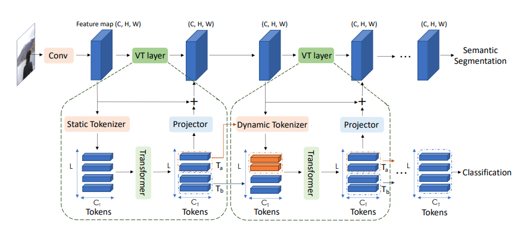

# (Pytorch) Visual Transformers: Token-based Image Representation and Processing for Computer Vision:
A Pytorch Implementation of the following paper "Visual Transformers: Token-based Image Representation and Processing for Computer Vision"

**Visual Transformers**
Find the original paper [here](https://arxiv.org/abs/2006.03677).

  

- This Pytorch Implementation is based on [This repo](https://github.com/tahmid0007/VisionTransformer). The default dataset used here is CIFAR10 which can be easily changed to ImageNet or anything else.
- You might need to install einops.
